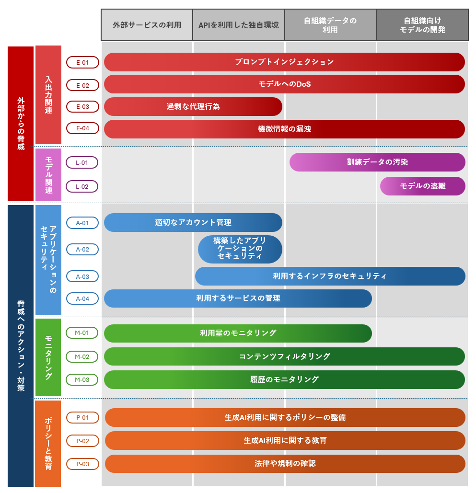

# 生成AIを利用する上でのセキュリティ成熟度モデル
[![CC BY-SA 4.0][cc-by-sa-shield]][cc-by-sa]

本ドキュメントは、[Creative Commons Attribution-ShareAlike 4.0 International License][cc-by-sa] ライセンスのもとに公開しています。

[![CC BY-SA 4.0][cc-by-sa-image]][cc-by-sa]

[cc-by-sa]: http://creativecommons.org/licenses/by-sa/4.0/
[cc-by-sa-image]: https://licensebuttons.net/l/by-sa/4.0/88x31.png
[cc-by-sa-shield]: https://img.shields.io/badge/License-CC%20BY--SA%204.0-blue.svg

## 概要
現在、様々な分野でテキスト、画像、動画等をAIを利用し自動生成する技術、生成AIの利用が進んでおり、今後さらに普及が予想されます。本ドキュメントは生成AIをセキュアに利用していくうえで必要な項目を生成AIの利用ケースごとにマッピングを行い、生成AIを利用していく組織の一助になることを目的としています。対象となる組織は、利用形態別に下記4つになります。
### 外部サービスの利用
ChatGPTやGemini等の外部サービスを提供元が提供するWebインタフェースやスマートフォンアプリケーション等から利用する組織。
### APIを利用した独自環境
OpenAI APIやGemini API等のAPIを自社のサービスや社内環境と連動させて利用する組織。
### 自組織データの利用
ファインチューニングやRAG(Retrieval-Augmented Generation)の技術を用いて自組織のデータを生成AIに利用する組織。 
### モデルの自組織向け開発
自組織向けにモデルを独自開発する組織。

## 脅威とアクション・対策の概要図

## プロジェクトメンバー
本ドキュメントは、NPO日本ネットワークセキュリティ協会 調査研究部会 AIセキュリティWGのメンバーによって作成されています。プロジェクトメンバーは以下の通りです。

### プロジェクトメンバー一覧(順不同)
* 服部 祐一(株式会社セキュアサイクル, JNSA調査研究部会AIセキュリティWGリーダー)

## 関連組織について

### NPO日本ネットワークセキュリティ協会（JNSA）
NPO日本ネットワークセキュリティ協会は、ネットワーク社会の情報セキュリティレベルの維持・向上及び日本における情報セキュリティ意識の啓発に努めるとともに、最新の情報セキュリティ技術および情報セキュリティへの脅威に関する情報提供などを行うことで、情報化社会へ貢献することを目的とした組織です。

[NPO日本ネットワークセキュリティ協会 公式サイト](https://www.jnsa.org/) 

## ライセンス
本ドキュメントは **[Creative Commons Attribution-Share Alike v4.0](https://creativecommons.org/licenses/by-sa/4.0/)** ライセンスのもとに公開しています。

## お問い合わせ先
本ドキュメントに関する質問、改善や要望等は、本GitHubリポジトリのIssueにてご連絡ください。